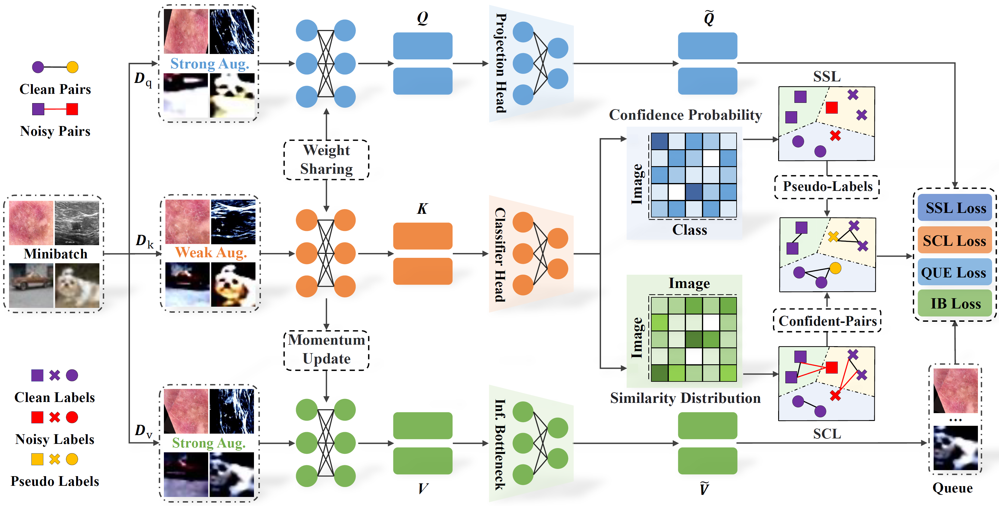

# Combating Medical Label Noise via Robust Semi-supervised Contrastive Learning (MICCAI 2023)




### Abstract:

To enhance the model's robustness and prevent noisy label memorization, this paper proposes a robust Semi-supervised Contrastive Learning paradigm called SSCL, which can efficiently merge semi-supervised learning and contrastive learning for combating medical label noise. Specifically, the proposed SSCL framework consists of three well-designed components: the Mixup Feature Embedding (MFE) module, the Semi-supervised Learning (SSL) module, and the Similarity Contrastive Learning (SCL) module. By taking the hybrid augmented images as inputs, the MFE module with momentum update mechanism is designed to mine abstract distributed feature representations. Meanwhile, a flexible pseudo-labeling promotion strategy is introduced into the SSL module, which can refine the supervised information of the noisy data with pseudo-labels based on initial categorical predictions. Benefitting from the measure of similarity between classification distributions, the SCL module can effectively capture more reliable confident pairs, further reducing the effects of label noise on contrastive learning. Furthermore, a noise-robust loss function is also leveraged to ensure the samples with correct labels dominate the learning process. 


### Requirements:
* Python 3.7.13
* Pytorch 1.12.1 
* Numpy 1.21.6
* cudatoolkit 11.7
* cudnn 8.5.0

### Download test models to weight:
```
https://pan.baidu.com/s/1Mpe7m3P3soH8FMqshr2F6A?pwd=sscl  Password: sscl 

```

### Running the code:
```
python main.py --r 0.5 --t 0.5 
```

### Please consider citing the following paper if you find this work useful for your research.

```
@inproceedings{chen2023sscl,
  title={Combating Medical Label Noise via Robust Semi-supervised Contrastive Learning},
  author={Chen, Bingzhi and Ye, Zhanhao and Liu, Yishu and  Zhang, Zheng and Pan, Jiahui and Zeng,
Biqing and Lu, Guangming },
  booktitle={International Conference on Medical Image Computing and Computer-Assisted Intervention},
  pages={xxx--xxx},
  year={2023},
  organization={Springer}
}
```
If you have any question, please contact us: chenbingzhi@m.scnu.edu.cn, or  darrenzz219@gmail.com.


